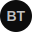

# 🚀 Nautilus Automação - Plataforma de Trading Profissional



Uma plataforma avançada de trading integrada com a API da Bitget, oferecendo análises em tempo real, gerenciamento de trades e dashboard completo para traders profissionais.

## ✅ Status do Projeto

- 🎯 **ORGANIZADO E LIMPO** - Estrutura profissional implementada
- 🗄️ **PostgreSQL MIGRADO** - Banco de dados em produção
- 🔧 **CREDENCIAIS API CORRIGIDAS** - Sistema funcionando perfeitamente
- 📦 **PRONTO PARA DEPLOY** - Backend e Frontend organizados

## 🚀 Características Principais

- **Dashboard Completo**: Visualização em tempo real de estatísticas, PnL e performance
- **Integração Bitget**: Conexão direta com a API da Bitget para dados reais
- **Segurança Avançada**: Criptografia AES-256 para chaves de API
- **Interface Moderna**: Design responsivo inspirado nas melhores plataformas de trading
- **Análise de Performance**: Gráficos de curva de lucro e métricas detalhadas
- **Gerenciamento de Trades**: Visualização de posições abertas e histórico completo

## 📁 Estrutura Organizada

```
RetesteProjeto/
├── 📁 backend/          # ✅ Código principal do backend
├── 📁 frontend/         # ✅ Código principal do frontend
├── 📁 docs/            # ✅ Documentação organizada
├── 📁 backend-deploy/   # ✅ Versão para deploy (Render)
├── 📁 frontend-deploy/  # ✅ Versão para deploy (Hostinger)
└── 📁 scripts/         # ✅ Scripts utilitários
```

## 🛠️ Tecnologias Utilizadas

### Backend
- **Flask**: Framework web Python
- **SQLAlchemy**: ORM para banco de dados
- **WebSocket**: Conexão em tempo real com Bitget
- **Cryptography**: Criptografia de dados sensíveis
- **bcrypt**: Hash seguro de senhas

### Frontend
- **React**: Biblioteca para interface de usuário
- **Material-UI**: Componentes de design moderno
- **Chart.js**: Gráficos interativos
- **Axios**: Cliente HTTP para API
- **React Router**: Navegação SPA

## 📋 Pré-requisitos

- Python 3.8 ou superior
- Node.js 16 ou superior
- npm ou yarn
- Conta na Bitget com API habilitada

## 🔧 Instalação

### 1. Clone o repositório
```bash
git clone https://github.com/seu-usuario/bit-nova.git
cd bit-nova
```

### 2. Configuração do Backend

#### Instale as dependências Python
```bash
pip install -r requirements.txt
```

#### Configure as variáveis de ambiente
```bash
cp .env.example .env
```

Edite o arquivo `.env` com suas configurações:
```env
# Chave secreta do Flask (gere uma chave segura)
FLASK_SECRET_KEY=sua_chave_secreta_muito_segura_aqui

# Chave de criptografia AES (32 bytes em base64)
AES_ENCRYPTION_KEY=sua_chave_aes_32_bytes_em_base64

# URL do banco de dados
DATABASE_URL=sqlite:///backend/instance/site.db

# Configurações opcionais da Bitget
BITGET_PASSPHRASE=sua_passphrase_bitget
```

#### Gere chaves seguras
```python
# Para gerar FLASK_SECRET_KEY
import secrets
print(secrets.token_hex(32))

# Para gerar AES_ENCRYPTION_KEY
import base64
import os
key = os.urandom(32)
print(base64.b64encode(key).decode())
```

### 3. Configuração do Frontend

#### Navegue para o diretório frontend
```bash
cd frontend
```

#### Instale as dependências
```bash
npm install
```

## 🚀 Executando a Aplicação

### Desenvolvimento

#### Backend (Terminal 1)
```bash
# Na raiz do projeto
python backend/app.py
```
O backend estará disponível em `http://localhost:5000`

#### Frontend (Terminal 2)
```bash
# No diretório frontend
npm start
```
O frontend estará disponível em `http://localhost:3000`

### Produção

#### Backend com Gunicorn
```bash
gunicorn -w 4 -b 0.0.0.0:5000 backend.app:app
```

#### Frontend (Build)
```bash
cd frontend
npm run build
# Sirva os arquivos estáticos com nginx ou outro servidor
```

## 🔐 Configuração da API Bitget

1. Acesse sua conta Bitget
2. Vá para **API Management**
3. Crie uma nova API Key com as seguintes permissões:
   - **Read**: Para acessar dados da conta
   - **Futures Trading**: Para trading de futuros (se necessário)
4. Anote sua **API Key**, **Secret Key** e **Passphrase**
5. Configure o IP whitelist se necessário

⚠️ **Importante**: Nunca compartilhe suas chaves de API. Elas são criptografadas e armazenadas com segurança na aplicação.

## 📊 Funcionalidades

### Dashboard Principal
- **Estatísticas Gerais**: PnL total, ROE médio, taxa de acerto
- **Saldo da Conta**: Patrimônio total, saldo disponível, margem
- **Gráfico de Lucro**: Curva de performance ao longo do tempo
- **Posições Abertas**: Trades ativos em tempo real
- **Histórico**: Todos os trades fechados com detalhes

### Autenticação
- **Registro Seguro**: Validação de senha complexa
- **Login Protegido**: Sessões seguras
- **Validação de API**: Verificação automática das credenciais Bitget

### Segurança
- **Criptografia AES-256**: Proteção de chaves de API
- **Hash bcrypt**: Senhas protegidas
- **Validação de Entrada**: Proteção contra ataques
- **Sessões Seguras**: Gerenciamento de autenticação

## 🔧 Estrutura do Projeto

```
bit-nova/
├── backend/
│   ├── api/
│   │   ├── bitget_client.py    # Cliente da API Bitget
│   │   └── dashboard.py        # Rotas do dashboard
│   ├── auth/
│   │   ├── login.py           # Lógica de autenticação
│   │   └── routes.py          # Rotas de auth
│   ├── models/
│   │   ├── user.py            # Modelo de usuário
│   │   └── trade.py           # Modelo de trade
│   ├── utils/
│   │   └── security.py        # Funções de segurança
│   ├── websocket/
│   │   └── bitget_ws.py       # Cliente WebSocket
│   └── app.py                 # Aplicação principal
├── frontend/
│   ├── public/
│   │   ├── index.html         # HTML principal
│   │   ├── manifest.json      # PWA manifest
│   │   └── favicon.svg        # Ícone da aplicação
│   └── src/
│       ├── components/
│       │   ├── Auth/          # Componentes de autenticação
│       │   └── Dashboard/     # Componentes do dashboard
│       ├── services/          # Serviços de API
│       ├── App.js             # Componente principal
│       └── index.js           # Ponto de entrada
├── requirements.txt           # Dependências Python
├── .env.example              # Exemplo de configuração
├── .gitignore               # Arquivos ignorados
└── README.md                # Este arquivo
```

## 🧪 Testes

### Backend
```bash
pytest backend/tests/
```

### Frontend
```bash
cd frontend
npm test
```

## 📝 API Endpoints

### Autenticação
- `POST /auth/register` - Registro de usuário
- `POST /auth/login` - Login
- `POST /auth/logout` - Logout
- `GET /auth/session` - Verificar sessão

### Dashboard
- `GET /api/dashboard/stats` - Estatísticas do usuário
- `GET /api/dashboard/trades/open` - Trades abertos
- `GET /api/dashboard/trades/closed` - Histórico de trades
- `GET /api/dashboard/profit-curve` - Dados do gráfico
- `POST /api/dashboard/sync-trades` - Sincronizar trades
- `GET /api/dashboard/balance` - Saldo da conta

## 🤝 Contribuição

1. Fork o projeto
2. Crie uma branch para sua feature (`git checkout -b feature/AmazingFeature`)
3. Commit suas mudanças (`git commit -m 'Add some AmazingFeature'`)
4. Push para a branch (`git push origin feature/AmazingFeature`)
5. Abra um Pull Request

## 📄 Licença

Este projeto está sob a licença MIT. Veja o arquivo [LICENSE](LICENSE) para detalhes.

## ⚠️ Disclaimer

Esta aplicação é para fins educacionais e de desenvolvimento. Trading de criptomoedas envolve riscos significativos. Use por sua própria conta e risco.

## 📞 Suporte

Para suporte e dúvidas:
- Abra uma [issue](https://github.com/seu-usuario/bit-nova/issues)
- Entre em contato: suporte@bitnova.app

---

**Nautilus Automação** - Trading Profissional Simplificado 🚀